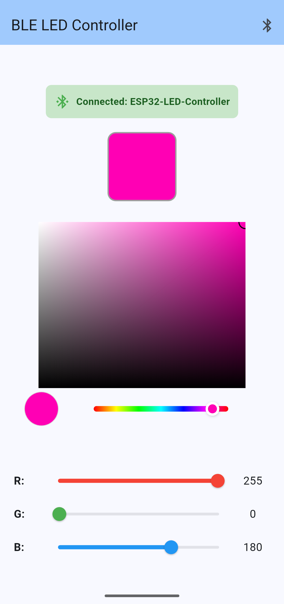

# MicroGlow BLE

Minimalistic Bluetooth LED controller for ESP32-S3 and WS2812B. Use it for ringlights, strips, accent lighting, or any creative LED project. I used it for a microscope lens light. I also included the stl file in the assets folder.

<p align="center">
   
   
   
</p>

---

**Note:** The included Flutter app is a crude proof-of-concept (my first Flutter app!) and is meant to "just work" for basic control. It’s not polished, but it gets the job done for this project.

---


## Getting Started

1. **Download the latest release:**
   - [Go to Releases](https://github.com/MerzSebastian/bluetooth_ws2812b_light/releases/latest)
   - Download the APK for Android and the Arduino `.ino` sketch

2. **Flash the Arduino sketch:**
   - Open `bluetooth_ws2812b_light.ino` in Arduino IDE
   - Install the required libraries:
     - FastLED
     - Preferences (built-in for ESP32)
   - Select your ESP32-S3 board and COM port

3. **Customize LED settings (optional):**
   - Edit these values in the `bluetooth_ws2812b_light.ino` file to match your hardware:

     ```cpp
     #define LED_PIN     13        // GPIO pin for WS2812B data
     #define NUM_LEDS    16       // Number of LEDs in your ring
     ```

4. **Upload the sketch:**
   - Click Upload in Arduino IDE
   - Open Serial Monitor (115200 baud) to see connection status

5. **Install the Android app:**
   - Transfer the APK to your phone and install it

6. **Connect and control:**
   - Power up your hardware
   - Open the app and connect via Bluetooth
   - Send RGB values to control the LEDs

---

## Hardware

- ESP32-S3 development board
- WS2812B LED ring/strip (default: 16 LEDs)
- 5V power supply
- Jumper wires


**Wiring:**

```
ESP32-S3          WS2812B Ring Light
--------          ------------------
GPIO 13   ------> Data In (DI/DIN)
5V        ------> VCC/5V
GND       ------> GND
```

---

## BLE Commands

Send RGB values as comma-separated string: `R,G,B`

Examples:
- `255,0,0` (red)
- `0,255,0` (green)
- `0,0,255` (blue)

---

## Features

- Minimalistic BLE control
- Simple RGB text commands
- EEPROM color memory
- Serial debug output

---

## Troubleshooting

- Check wiring and power
- Confirm board and port selection
- Use Serial Monitor for debug info

---


## License

This project is licensed under the GNU General Public License v3.0 (GPLv3).
See the LICENSE file for full terms.

## Usage

### Connecting via Bluetooth

1. Upload the code to your ESP32-S3
2. The device will appear as **"ESP32-LED-Controller"** in Bluetooth settings
3. Use a BLE app to connect:
   - **Android:** nRF Connect, BLE Scanner, Serial Bluetooth Terminal
   - **iOS:** nRF Connect, LightBlue
   - **Windows/Mac:** nRF Connect, Web Bluetooth apps

### Using nRF Connect App

1. Open nRF Connect and scan for devices
2. Connect to "ESP32-LED-Controller"
3. Look for the service UUID ending in `914b`
4. Find the characteristic UUID ending in `26a8`
5. Tap the write button (↑) 
6. Enter your RGB values (e.g., `255,0,0`)
7. Send the command

## Features

- ✅ Bluetooth Low Energy (BLE) for low power consumption
- ✅ Simple RGB control via text commands
- ✅ Supports any number of WS2812B LEDs (adjust `NUM_LEDS`)
- ✅ Auto-reconnection support
- ✅ Serial debugging output
- ✅ Input validation (0-255 range)

## Troubleshooting

**LEDs don't light up:**
- Check wiring connections
- Verify power supply is adequate (WS2812B needs 5V)
- Confirm `NUM_LEDS` matches your actual LED count
- Try a different GPIO pin and update `LED_PIN`

**Can't find Bluetooth device:**
- Make sure ESP32 is powered and code is uploaded
- Check Serial Monitor for "BLE device is ready!" message
- Try restarting your phone/computer Bluetooth
- Move closer to the ESP32

**Wrong colors:**
- Some WS2812B variants use different color orders
- Try changing `COLOR_ORDER` from `GRB` to `RGB` or `BRG`

**ESP32 resets/crashes:**
- Use external power supply for LED strip
- Ensure common ground between ESP32 and power supply
- Add capacitor across power supply

## Customization Ideas

- Add brightness control
- Implement color patterns and animations
- Add multiple color zones
- Create preset color modes
- Add automatic color cycling
- Implement music reactive lighting


## License

This project is licensed under the GNU General Public License v3.0 (GPLv3).
You must comply with the terms of the GPLv3 when using, modifying, or distributing this project.
See the LICENSE file for details.

## Credits

- FastLED library by Daniel Garcia
- ESP32 Arduino core by Espressif Systems
